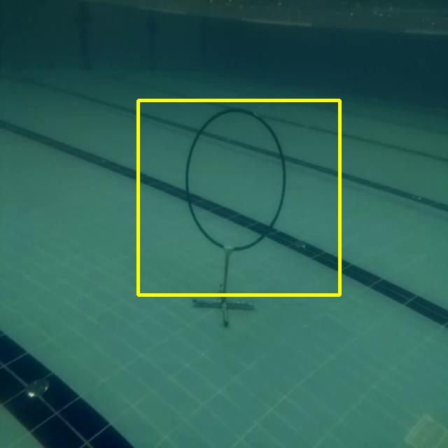
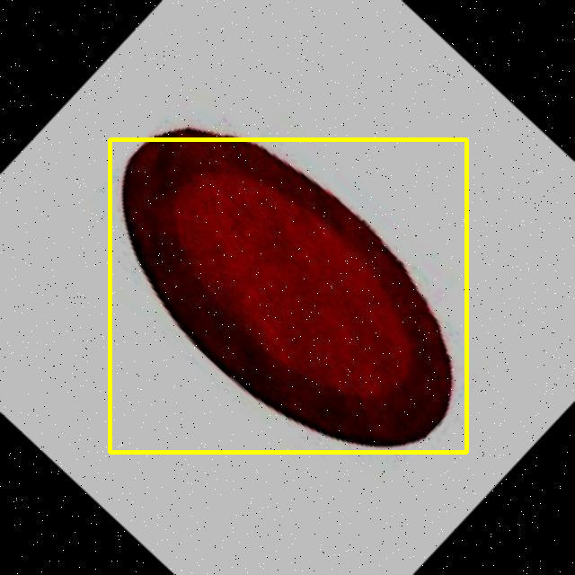

# cnn_circle_detection
This is a PyTorch implementation of a Deep Convolutional Neural Network model for detecting circle objects in images.

# Network Architecture

The output of the network is 4 real numbers which represents the detected center coordinates x,y,width and height.

# Getting Started

**Installation**
- Clone this repo:
```shell
git clone https://github.com/wyattPol/circle_detection_cnn
```

- Requirements
Install the dependencies by running the following command:
```shell
pip install -r requirements.txt
```

# Model training
- Data set
[here is dataset source]

```shell
https://universe.roboflow.com/trees-m4e49/-39p4p/dataset/1
```

- Training:

```shell
python train3.py
```

- Resume training from a saved model:

You are able to resume training your model from a saved checkpoint by running the following:

```shell
python train.py --resume {directory path to your saved model}
```
# Model Testing

THere is already the test.py you can use(be careful with path):

```shell
python test.py
``` 
In this repo you can see 2 network, folder model_net is the trained model from network.py.
folder model_net_1 contains the trained model from network2.py.

# Results on examples

Display like below 





